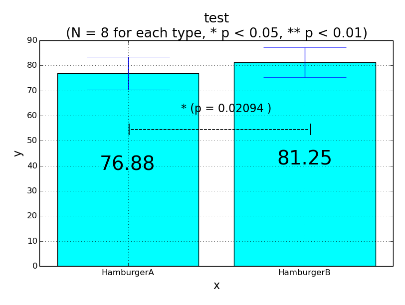

# 同じ被験者の条件ごとの計量尺度に基づくデータの比較 (例：ふれ合い時間）  

- 1. 対応のある2条件の平均値の差の検定  
- 例：同じ被験者で，ロボット1，ロボット2とのふれ合い時間を比較

# 異なる被験者の条件ごとの計量尺度に基づくデータの比較 (例：ふれ合い時間）  

- 1. 対応のない2条件の平均値の差の検定（分散が等質な場合）  
- 2. 対応のない2条件の平均値の差の検定（分散が等質でない場合）
- 例：異なる被験者で，ロボット1，ロボット2とのふれ合い時間のデータを集めて比較  

# サンプル

- 対応のあるt検定
```python sample_two_sample_test_of_interval_and_ratio_scale.py 1```


- 対応のないt検定
```python sample_two_sample_test_of_interval_and_ratio_scale.py 2```


```python sample_two_sample_test_of_interval_and_ratio_scale.py 3```


# How to report results

- A paired-samples t-test

```
A paired-samples t-test was conducted to compare <fill DV measure> in <fill IV level/ condition1> and <fill IV level / condition2> conditions.
There was a significant (not a significant) difference in the scores for <fill IV level1> (M=<fill average1> , SD=<fill SD1> ) and IV level2 (M=<fill average2> , SD=<fill SD2>) conditions; t(<fill df>)=<fill t value>, p=<fill p value>.
```

- an independent-samples t-test 

```
An independent-samples t-test was conducted to compare <fill DV measure> in <fill IV level/ condition1> and <fill IV level / condition2> conditions.
There was a significant (not a significant) difference in the scores for <fill IV level1> (M=<fill average1> , SD=<fill SD1> ) and IV level2 (M=<fill average2> , SD=<fill SD2>) conditions; t(<fill df>)=<fill t value>, p=<fill p value>.
```