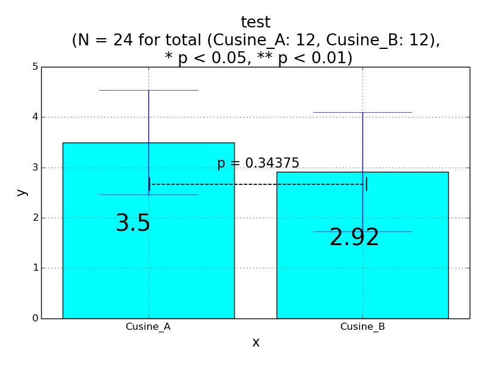
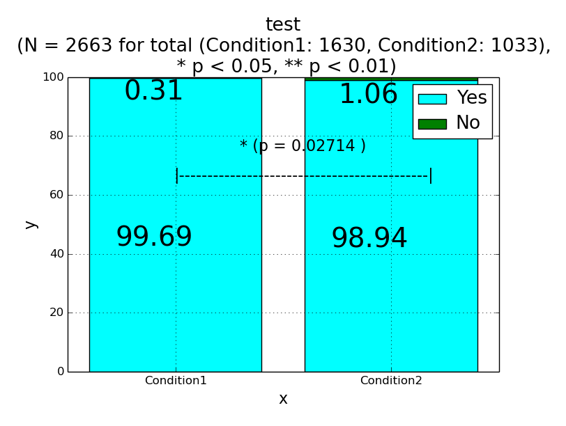
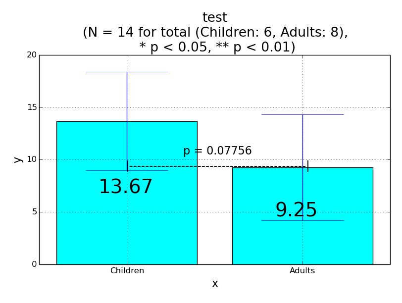
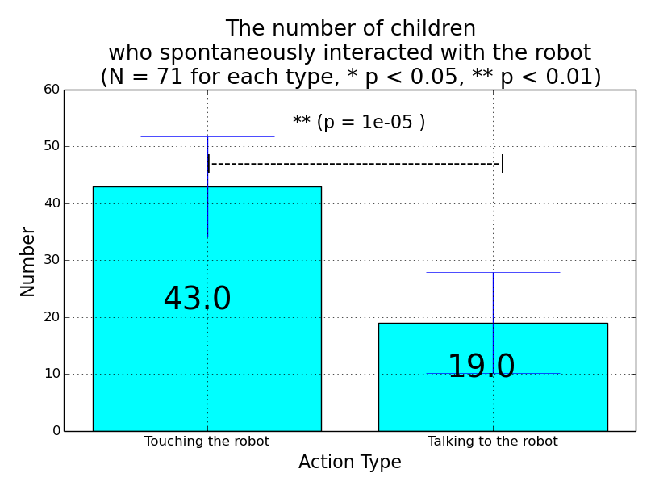
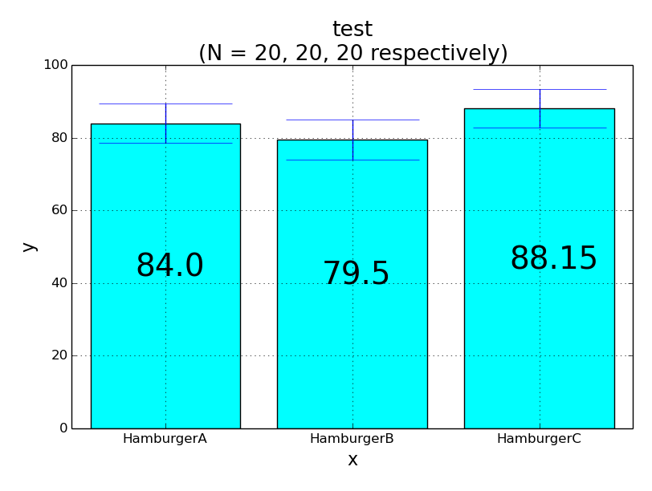
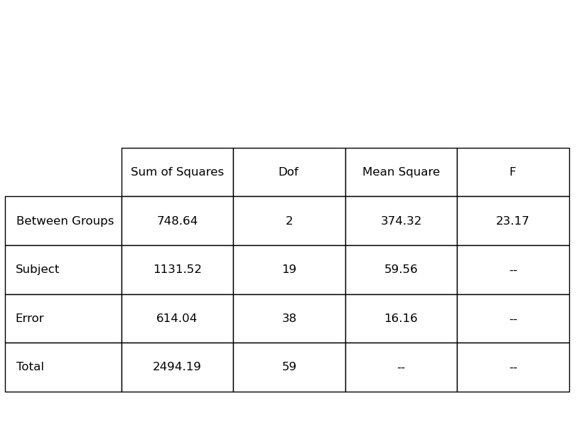
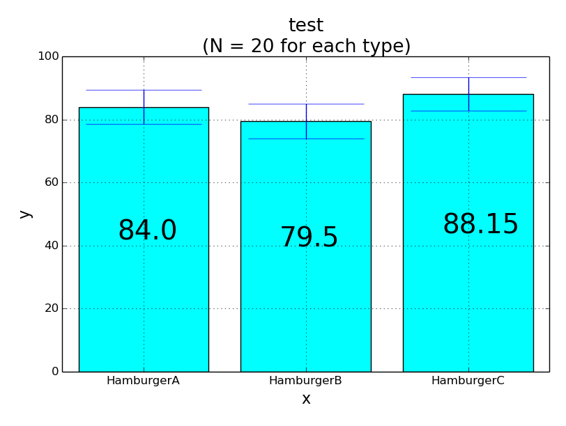

# 2標本検定

## 同じ被験者に体験前後でアンケート (対応有り)

### Yes/ No 形式 (名義尺度)：マクネマーの検定
### グレード形式 (順位尺度)：ウィルコクソンの符号付き順位和検定


## 同じ被験者のふれ合いについて、計量尺度に基づくデータ取得 (対応有り)

### ロボット1, ロボット2とのふれ合い時間の比較 (計量尺度)：対応のあるt検定


## 条件1、条件2ごとにアンケート (対応無し)

### Yes/ No 形式 (名義尺度)：

- 前向き研究 => フィッシャーの正確検定
- 後ろ向き研究 => カイ2乗検定 (クラメールの連関計数)

％ 前向き研究：条件1 10人、条件2 10人と初めに決めて、体験後にアンケート(Yes, No)。Yes, Noの人数が求まるので分布を比較する。
％ 横断研究：総数だけ初めに決めて、体験後にアンケート(Yes, No)。Yes, Noの人数、条件ごとの人数が求まるので分布を比較する。

### グレード形式 (順位尺度)：ウィルコクソンの2標本検定/ ウィルコクソンの順位和検定/ マン・ホイットニィのU検定


## 条件1、条件2ごとに、計量尺度に基づくデータ取得 (対応無し)

### 条件ごとのふれ合い時間の比較 (計量尺度)：対応のないt検定

## サンプル

- 対応のあるU検定
```python sample_t_test.py 1```


- 対応のあるt検定

```python sample_t_test.py 3```


- カイ二乗検定
```python sample_chi_squared_test.py```


- 対応のないU検定
```python sample_t_test.py 2```


- 対応のないt検定
```python sample_t_test.py 1```


```python sample_t_test.py 2```


# 多標本検定

## 分散分析

### 一元配置
### 二元配置

## サンプル

- one-way factrial ANOVA (一元配置要因分散分析、被験者間計画)
```python sample_t_test.py between```



- one-way repeated measures ANOVA (一元配置反復測定分散分析、被験者内計画)
```python sample_t_test.py within```




