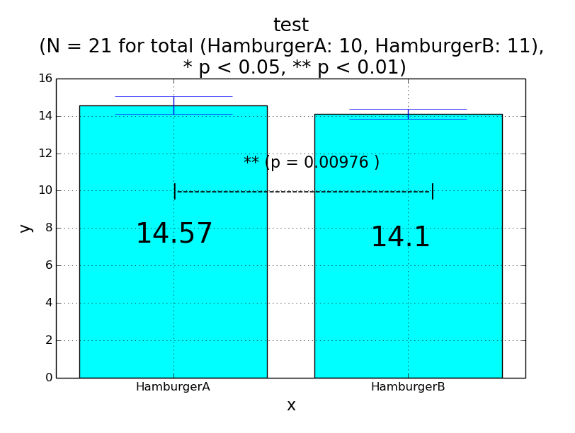
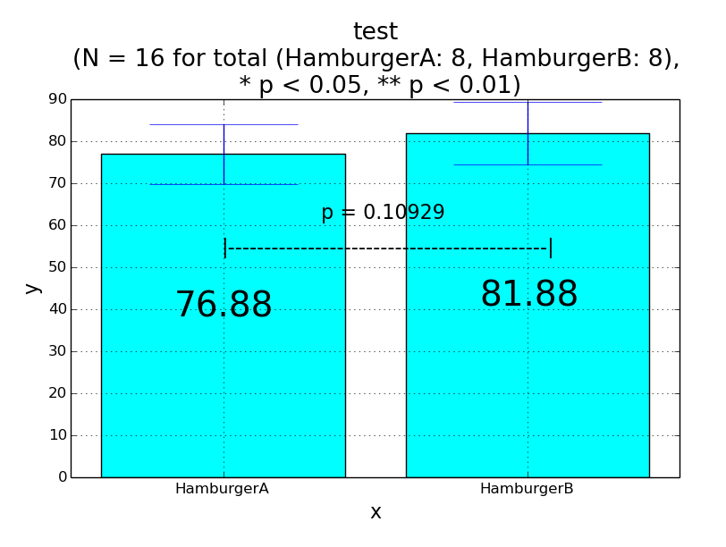

# 同じ被験者のふれ合いについて，計量尺度に基づくデータ取得 (対応有り)

- 例：ロボット1, ロボット2とのふれ合い時間の比較 (計量尺度)：対応のある2条件の平均値の差の検定

# 条件1，条件2ごとに，計量尺度に基づくデータ取得 (対応無し)

- 例：条件ごとのふれ合い時間の比較 (計量尺度)：  
対応のない2条件の平均値の差の検定（分散が等質な場合）  
対応のない2条件の平均値の差の検定（分散が等質でない場合）  

# サンプル

- 対応のあるt検定
```python sample_two_sample_test_of_interval_and_ratio_scale.py 1```


- 対応のないt検定
```python sample_two_sample_test_of_interval_and_ratio_scale.py 2```


```python sample_two_sample_test_of_interval_and_ratio_scale.py 3```
